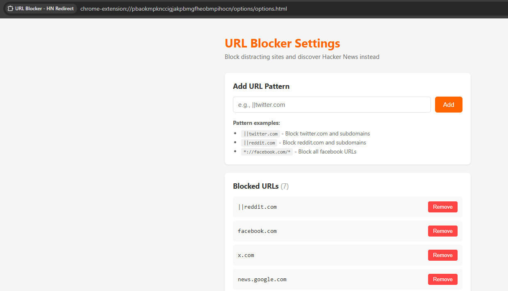

# URL Blocker - Hacker News Redirect

**Break the doom-scrolling cycle. Discover something worth reading instead.**

---

## The Problem We All Face

We've all been there. You sit down to work, full of motivation and a clear to-do list. Then, almost unconsciously, your fingers type "twitter.com" or "reddit.com" into the browser. Twenty minutes later, you're deep in a thread about something completely irrelevant to your life, wondering where the time went.

Traditional site blockers just show you a blank page or an error message. That momentary friction rarely stops us—we just open another tab and try again, or find a different distraction. The habit loop remains unbroken.

## A Different Approach

**URL Blocker - HN Redirect** takes a different path. Instead of simply blocking distracting sites, it _redirects_ you to something genuinely interesting—a random article from Hacker News.

The idea is simple: if you're going to procrastinate anyway, why not stumble upon something that might actually teach you something new? A fascinating deep-dive into distributed systems. A startup post-mortem. A quirky side project. Something that feeds your curiosity instead of draining your attention.

## How It Works

1. **You add sites to your blocklist** — Twitter, Reddit, Instagram, whatever your personal kryptonite is
2. **When you try to visit them** — the extension intercepts the request
3. **Instead of a boring block page** — you're shown a brief loading screen and then redirected to a random top story from Hacker News

---

## Screenshots

### Settings Panel



---

## Demo Video

https://github.com/user-attachments/assets/URL-Blocker-example.mp4

[Download Demo Video](screenshots/URL%20Blocker%20example.mp4)

---

## Features

- **Clean Settings Interface** — Easily add and remove URL patterns from your blocklist
- **Smart Pattern Matching** — Block entire domains, subdomains, or specific URL patterns
- **Privacy Focused** — No data collection, no analytics, everything stays local

---

## Setup Instructions

### Installing on Chrome (Developer Mode)

Since this extension isn't on the Chrome Web Store, you'll need to load it as an unpacked extension. Don't worry—it only takes a minute!

#### Step 1: Download the Extension

```bash
git clone https://github.com/your-username/url-blocker.git
```

Or download and extract the ZIP file to a folder on your computer.

#### Step 2: Open Chrome Extensions Page

1. Open Google Chrome
2. Type `chrome://extensions` in the address bar and press Enter
3. Or navigate via Menu (⋮) → **More Tools** → **Extensions**

#### Step 3: Enable Developer Mode

1. Look for the **"Developer mode"** toggle in the top-right corner
2. Click it to turn it **ON**

#### Step 4: Load the Extension

1. Click the **"Load unpacked"** button that appears
2. Navigate to the folder where you downloaded/cloned this extension
3. Select the folder and click **"Select Folder"**

#### Step 5: Pin the Extension (Optional)

1. Click the puzzle piece icon (🧩) in Chrome's toolbar
2. Find **"URL Blocker - HN Redirect"** in the list
3. Click the pin icon to keep it visible in your toolbar

#### Step 6: Configure Your Blocklist

1. Click on the extension icon in your toolbar
2. Add the sites you want to block using patterns like:
   - `||twitter.com` — blocks twitter.com and all subdomains
   - `||reddit.com` — blocks reddit.com and all subdomains
   - `*://facebook.com/*` — blocks all facebook.com URLs
3. Click **"Add to Blocklist"** for each site

#### You're All Set!

Try visiting one of your blocked sites. You should see a brief loading screen followed by a redirect to an interesting Hacker News article.

---

## URL Pattern Examples

| Pattern              | What it blocks                                          |
| -------------------- | ------------------------------------------------------- |
| `\|\|twitter.com`    | twitter.com and all subdomains (x.com won't be blocked) |
| `\|\|reddit.com`     | reddit.com, old.reddit.com, www.reddit.com, etc.        |
| `*://facebook.com/*` | All facebook.com pages                                  |
| `\|\|instagram.com`  | instagram.com and all subdomains                        |
| `\|\|youtube.com`    | youtube.com (nuclear option!)                           |

---

## Troubleshooting

**Extension not blocking sites?**

- Make sure Developer Mode is still enabled
- Try removing and re-adding the URL pattern
- Check that the pattern matches the site format (see examples above)

**Redirect not working?**

- Ensure you have an internet connection (we fetch from Hacker News API)
- Check the browser console for any error messages

---

## Contributing

Found a bug? Have an idea for improvement? Feel free to open an issue or submit a pull request!

---

## License

MIT License - feel free to use, modify, and share.

---

_Built with frustration at my own lack of self-control, and hope that random interesting articles might be a better use of time than infinite feeds._
